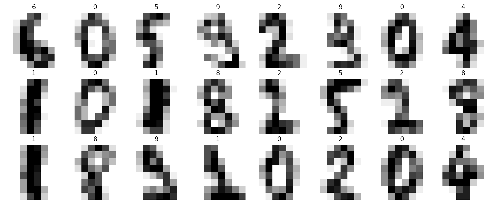
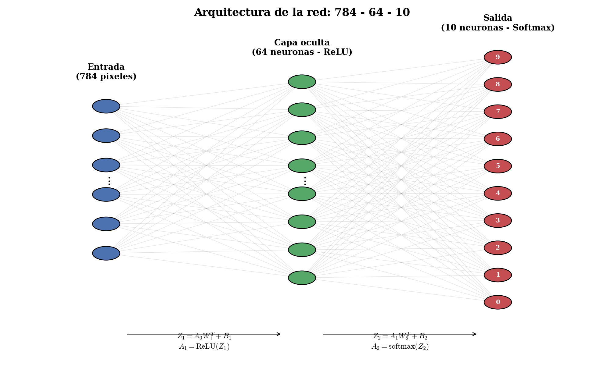

# Red Neuronal desde Cero: Clasificador MNIST

Implementación de una red neuronal multicapa construida íntegramente con NumPy, sin frameworks de deep learning, para la clasificación de dígitos manuscritos del conjunto de datos MNIST. El objetivo del proyecto es documentar de forma explícita el álgebra que sostiene el entrenamiento de una red neuronal: propagación hacia adelante, retropropagación del error y actualización de parámetros mediante descenso de gradiente.




## Descripción general

Este proyecto está pensado como material de estudio y referencia. En lugar de recurrir a bibliotecas como PyTorch o TensorFlow, cada componente de la red, funciones de activación, forward pass, cálculo de gradientes y optimización, se implementa manualmente utilizando operaciones matriciales de NumPy. El notebook incluido recorre el proceso completo, desde la carga de los datos hasta la evaluación del modelo, acompañado de las derivaciones matemáticas correspondientes.

## Conjunto de datos

El proyecto utiliza el conjunto de datos MNIST, compuesto por 70.000 imágenes de dígitos manuscritos (0 a 9), cada una de 28 por 28 píxeles en escala de grises. En su forma tabular (CSV), cada fila representa una imagen aplanada en un vector de 784 valores, precedido por la etiqueta correspondiente:

| Columna | Contenido |
|---|---|
| `label` | Dígito real (0 a 9) |
| `pixel0` ... `pixel783` | Los 784 valores de intensidad de píxel (0 a 255) que componen la imagen de 28x28 |

## Arquitectura de la red

Se emplea un perceptrón multicapa con una única capa oculta:

- **Capa de entrada:** 784 neuronas, una por cada píxel de la imagen.
- **Capa oculta:** 64 neuronas con función de activación ReLU.
- **Capa de salida:** 10 neuronas con activación Softmax, que produce una distribución de probabilidad sobre los diez dígitos posibles.



## Formulación matemática

### Propagación hacia adelante

Dada una entrada $A_0 = X$, las activaciones se calculan capa por capa:

$$Z_1 = A_0 W_1^T + B_1 \qquad A_1 = \mathrm{ReLU}(Z_1)$$

$$Z_2 = A_1 W_2^T + B_2 \qquad A_2 = \mathrm{softmax}(Z_2)$$

### Retropropagación

El gradiente del error respecto a cada parámetro se obtiene aplicando la regla de la cadena, comenzando en la capa de salida y propagando el error hacia la capa oculta.

**Capa de salida:**

$$\frac{\partial E}{\partial W_2} = (A_2 - Y)^T \cdot A_1 \qquad \frac{\partial E}{\partial B_2} = \sum (A_2 - Y)$$

**Capa oculta:**

$$\frac{\partial E}{\partial W_1} = \left[ (A_2 - Y) \cdot W_2 \right] \odot \mathrm{ReLU}'(Z_1)^T \cdot A_0$$

$$\frac{\partial E}{\partial B_1} = \sum \left[ (A_2 - Y) \cdot W_2 \right] \odot \mathrm{ReLU}'(Z_1)$$

donde $Y$ es la matriz de etiquetas reales en formato one-hot, $\mathrm{ReLU}'(Z_1)$ es la derivada de la ReLU (1 donde $Z_1 > 0$, 0 en caso contrario) y $\odot$ denota el producto de Hadamard.

### Actualización de parámetros

Los parámetros se actualizan mediante descenso de gradiente con una tasa de aprendizaje $\alpha$:

$$W_1 \leftarrow W_1 - \alpha \, \frac{\partial E}{\partial W_1} \qquad B_1 \leftarrow B_1 - \alpha \, \frac{\partial E}{\partial B_1}$$

$$W_2 \leftarrow W_2 - \alpha \, \frac{\partial E}{\partial W_2} \qquad B_2 \leftarrow B_2 - \alpha \, \frac{\partial E}{\partial B_2}$$

## Estructura del repositorio

```
.
├── notebook.ipynb          # Notebook principal con el desarrollo completo
├── data/
│   └── mnist_train.csv     # Conjunto de datos (no inlcuidos debido a que excede el límite de GitHub)
├── img/
│   ├── architecture.png
│   └── sample_digits.png
└── README.md
```


## Resultados

Con la configuración utilizada (una capa oculta de 64 neuronas, descenso de gradiente por lotes y una tasa de aprendizaje de 0.5), el modelo alcanza aproximadamente un 95% de precisión tanto en el conjunto de entrenamiento como en el conjunto de test tras varios cientos de iteraciones.

El notebook incluye, además, una matriz de confusión, ejemplos de predicciones sobre imágenes de test y una visualización de los pesos aprendidos por la capa oculta, interpretados como los patrones que cada neurona detecta en la imagen de entrada.

